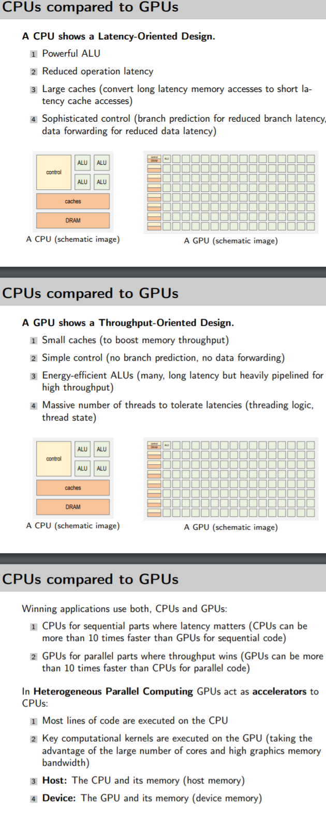
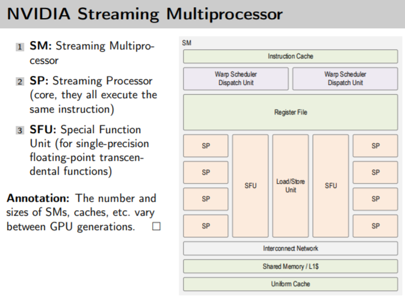
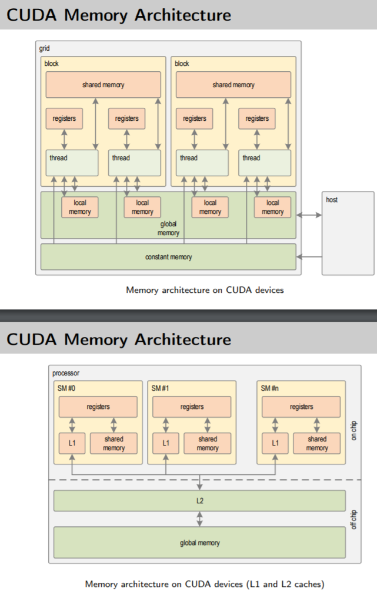
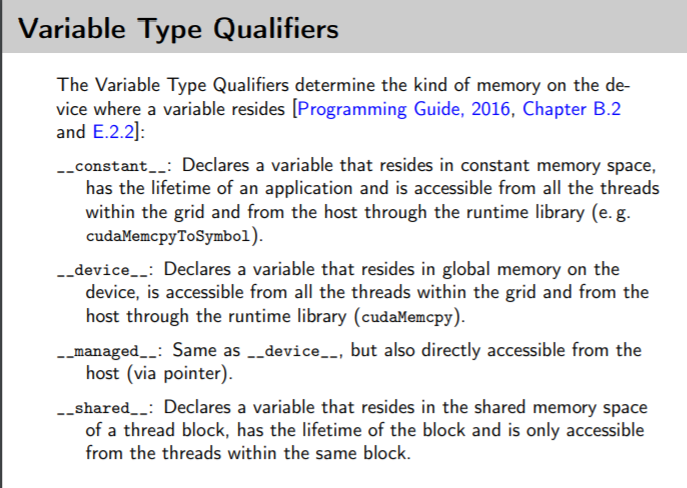
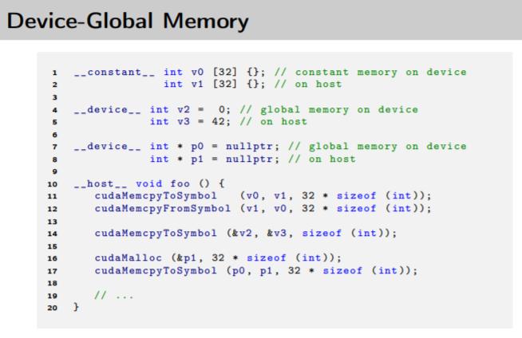
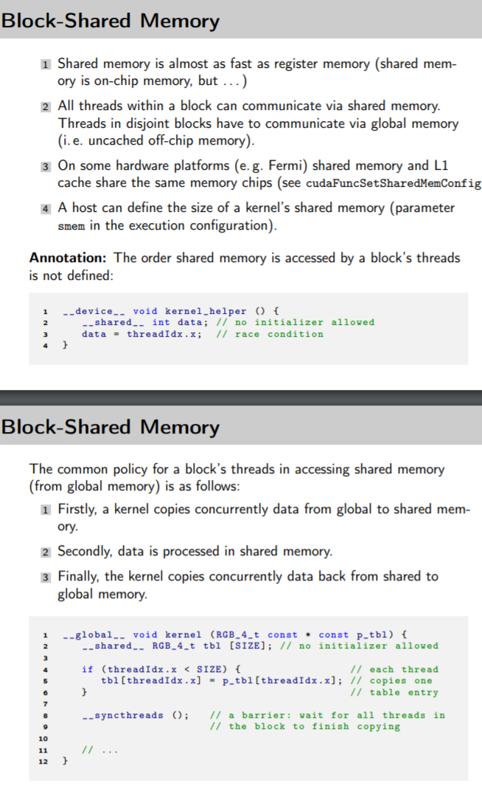
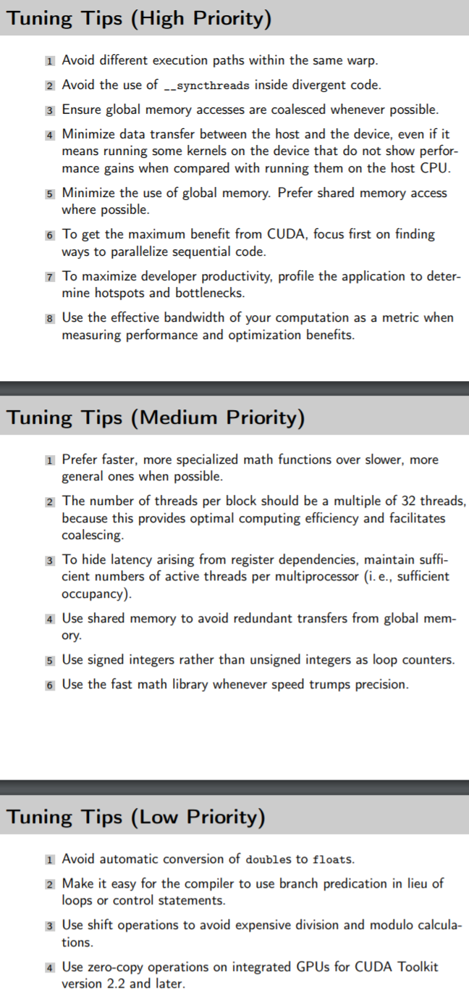

# CUDA Terms
- Grid: Consists of Blocks
- Block: Consists of e.g. 1024 Threads
- Thread: One e.g. Function call on the Device
- Warp: Block of 32 Threads

# Answers
- GPUs try to hide latencies by having “a lot of work in flight”

# GPGPU
- General Purpose Graphic Processing Unit
- Fine Grained SIMD Architecture

## CPU VS GPU

## Nvidia SM Architecture

## CUDA Memory Architecture

## Storage of Values

## Tuning Tipps
