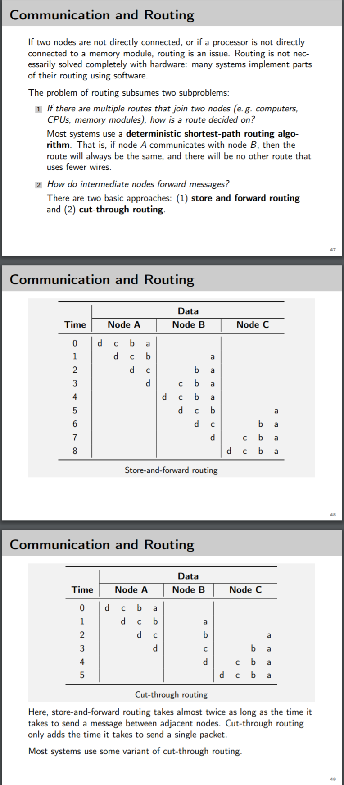

# MPV Part I - CPU & GPU Tuning

# Intro 1
## Warum Parallelisieren?
- Grenzen der Hardware erreicht
- Darum parallelisieren

## Laws
- Moore => alle 2 Jahre verrdoppelung der Leistungsfähigkeit der Hardware
- Amdahl => Problem schneller lösen
- Gustafson => größeres Problem in gleicher Zeit lösen
## Taxonomy

- of Parallel Systems
  - Speicherart
  - Kommunikationsart
  - Konstruktionsart
- Memory
  - Shared
  - Distributes
  - Distributed-Shared
  - Uniform or Non-Uniform Memory Access
  - Cache: Schnell + Nahe am Prozessor
- Kommunikationsart
  - Shared Memory = gleichzeitger Zugriff
  - Verteilt = versenden von Datenpaketen über Topology und Verbindungsnetzwerk = Message Passing
- Konstruktion
  - Cluster
  - Grid
  - Multicore
  - Vector
  - FPGAs
  - ...

## Buzzword Bingo
- Speedup = Vorher / Nachher = T1 / Tn
  - Es wird nur der Parallele Anteil schneller
  - Linear, Superlinear, Sublinear
  - 
- Amdahls Law: 
  - 
  - Es bringt nur begrenzt etwas immmer mehr Prozessoren zu verwenden => nur der parallele Anteil wird schneller
  - Das Programm sollte möglichst nur aus parallelen Teilen bestehen
  - Selten möchte man ein
Problem einer bestimmten Größe durch immer höheren Ressourcenaufwand auch immer schneller berechnen können

- Gustafsons Law = 1 + P*(N-1)
  - 
  - Anstatt das Programm schneller zu machen kann man ein größeres Problem in der Gleichen Zeit rechnen
  - Skaliert ~Linear
  - Beispiel Straßenbau => Mehr Arbeiter = Paralleles Arbeiten an mehreren Teilabschnitten und nicht einen Teilabschnitt möglichst schnell fertigstellen
- Efficiency = Speedup / Recheneinheiten = Sp,n / n = Sp,4 / 4 für 4 Threads
  - Usually Sublinear => Kommunikations + Synchronisationsaufwand
  - Superlinear z.B. durch caching Effekte
  - gibt an, wie gut Prozessoren bei der Berechnung einer Aufgabe ausgelastet sind
- Scaling
  - 
  - Unter Skalierbarkeit versteht man die Fähigkeit eines parallelen Systems, seine Leistungsfähigkeit proportional mit der Zahl neu hinzugefügter Recheneinheiten zu steigern.
  - Dabei zu beachten
    - Datentransfer CPU <-> Speicher
    - Güte der verwendeten Algorithmen
    - Latenz + Bandbreite im Netz
    - Mehraufwand der Parallelisierung in Hard- und Software

## Wan Welches Gesetz verwenden?
- Amdahl => Fixe Problemgröße => Das Problem schneller lösen
- Gustafson => größeres Problem in der gleichen Zeit (Straßenbau) oder detailierter lösen (Wettervorhersage)

# Intro 2
## Why Parallel Computing
- Decoupeling of e.g. Front and Backend => Responsiveness
- Faster calculation
- Solving bigger problems => Scalability
- Use resources efficiently => Cloud Services
- Hardware => phisical limit reached

## Buzzword Bingo
- The Free Lunch is over
  - automatic Speedup through next hardware generation is no longer given => you get more cores not faster CPUs 
- Grand Challenge Problems
  - 
- flop/s
  - Floating Point Operations per Second
  - measurement of computer performance
- Pipelining
  - Pipelining and vectorization do not work well for many branches and
irregular data structures.
  - Pipelineing and vectorization do not scale well. The upper limit on
their speed will be some small multiple of the speed of the CPU.
  - 
- The Need for more Power
  - More power to solve bigger problems or problems in more detail ... to drive science forward
- NUMA System
  - Non Uniform Memory Access System
- Write Through
  - When updating a shared variable in the cache the value in the main memory is also updated immediately
- Bus Snooping / Cache Coherence / Cache Consistency
  - When a shared variable in the cache is updated the value in other caches gets wrong/outdated.
  - Solution: Write Through => The cache controllers Bus Snooping leads to updateing the value in the cache since now the write is visible to all cache controllers and they update their values 
- ILP:
  - Instruction Level Parallelism
  - 
- Pleasingly Parallel
  - Anzahl Kerne perfekt oder Parallelisierungsgrad hoch genug 

## Supercomputer
- Enourmous power
  - e.g. weather forecast
    - result interesting before the weather has happened
    - e.g. if it takes 7 days to calulate the weather of tomorrow it is no longer interesting nor a forecast

## Architectures
- Von Neumann
  - 
  - CPU
    - Registers, very fast
    - Control Unit
    - Arithmetic-Logical Unit - ALU
  - Main Memory
  - Main Memory -- BUS -- Registers
  - Bottleneck
    - Memory <--> CPU Data and Instruction Transmission

## Parallelism

## SIMD
- Single CPU exclusively for control
- Large collection of ALUs with own small memory
- synchronous execution
- 2 Sates
  - execute instruction
  - idle
- Disadvantage
  - often idle with conditional branches
- Pros
  - easy to program
  - scale well
## MIMD
- Each processor = full CPU
  - ALU
  - Control Unit
- NO GLOBAL CLOCK
- autonomous not synchronous like SIMD
- Asynchronous
- Shared memory system MIMD = multiprocessors
- Distributed memory system MIMD = multicomputer

## Dynamic Interconnection Networks

- Examples
  - 

## Static Interconnection Networks
- Examples
  - Array
  - Ring
  - Hypercube
    - lacks scalability
  - Hypercube + linear Array
    - Meshes
    - Tori
- Pros
  - scale well
  - number of available wires EXTREMELY limited
    - 2 Nodes can communicate for sure but may already be blocking all others

## Communication and Routing

## Shared Memory Programming

- Semaphores
  - binary
- Atomic Operations
- Barrier
  - When are all sub processes finished => barrier handles that
- Monitor
  - Offers data manipulation interface
  - Encapsulates shared data and operations
  - is a function called all ohters can't call that function
  - prevents inconsistency
- Message Passing
  -  

